# Generic Bot Architecture Design

## Overview

The bot is a **fully generic, configuration-driven system** where all repository-specific behavior is controlled through TOML configuration. **Rocq is just a configured instance**, not special code.

## Core Design Principles

1. **No Hardcoded Patterns**: All detection via configuration or APIs
2. **Configuration-Driven**: Repository features enabled via TOML, not code
3. **3-Tier Resolution**: Explicit TOML > API Auto-Detection > Generic Defaults
4. **Feature Flags**: Features enabled/disabled via configuration values

## Architecture Workflow

### Startup Flow

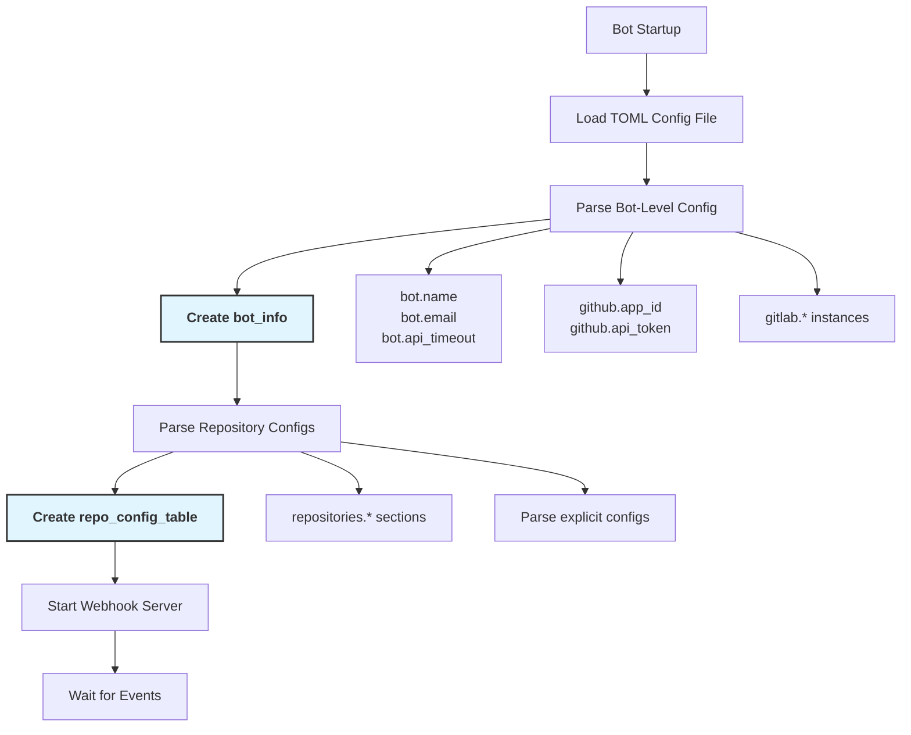

### Webhook Event Processing Flow

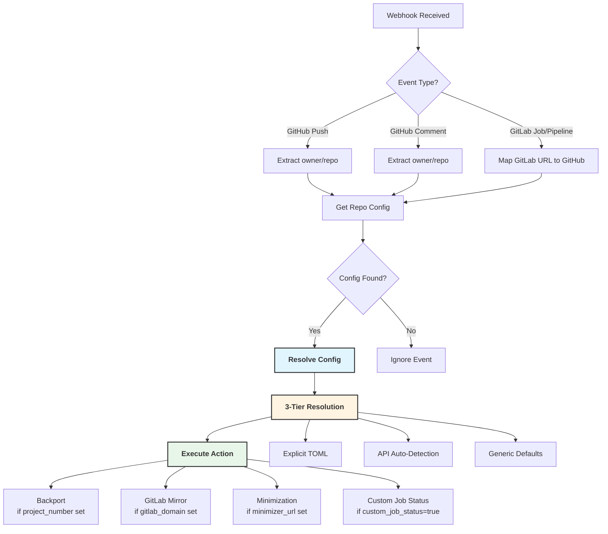

### Configuration Resolution Flow

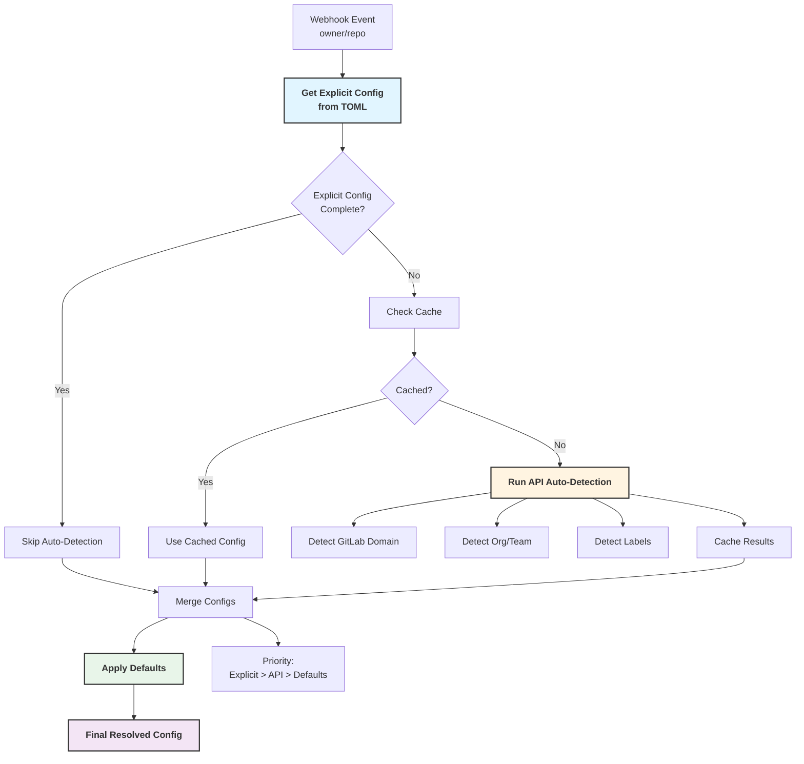

**Step-by-Step Explanation:**

1. **Webhook Event (owner/repo)**: A webhook arrives (push, comment, etc.) with owner and repo identifiers.

2. **Get Explicit Config from TOML**: Look up `repo_config_table` to find explicit configuration entry for this repository.

3. **Explicit Config Complete?**: Check if required fields (`gitlab_domain`, `org_name`) are present.
   - **Yes** -> Skip auto-detection (use explicit config)
   - **No** -> Proceed to auto-detection

4. **Check Cache** (if explicit config incomplete): Query in-memory cache for previous auto-detection result for this repository.

5. **Cached?**: Check if valid cached result exists (< 1 hour old).
   - **Yes** -> **Use Cached Config**: Return cached auto-detection result immediately, avoiding API calls. This improves performance and reduces rate limit usage.
   - **No** -> **Run API Auto-Detection**: Make GitHub/GitLab API calls to detect missing values.

6. **Run API Auto-Detection** (if not cached):
   - **Detect GitLab Domain**: Search all configured GitLab instances for matching project
   - **Detect Org/Team**: Query GitHub API for organization and team information
   - **Detect Labels**: Fetch repository labels from GitHub API
   - **Cache Results**: Store detected config with timestamp (TTL: 1 hour)

7. **Merge Configs**: Combine explicit TOML config, auto-detected (or cached) values, and defaults with priority: **Explicit > API/Cached > Defaults**.

8. **Apply Defaults**: Fill any remaining missing fields with generic defaults (e.g., `team_name = "maintainers"`).

9. **Final Resolved Config**: Complete configuration ready for use by bot features.

**What "Cached? Yes" Means:**
- A previous auto-detection result exists for this repository and is still valid (< 1 hour old)
- The cached config is returned immediately without making API calls
- This reduces API rate limit usage and improves response time

**Example Flow:**
- **First request** for `my-org/my-repo`: No cache -> API calls -> Cache result
- **Second request** within 1 hour: Cache hit -> Use cached result -> No API calls

### Feature Execution Flow

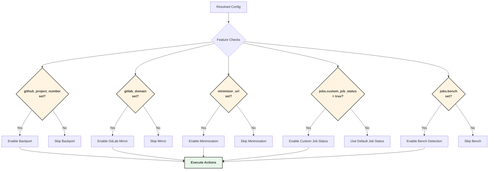

### Step-by-Step Setup Process

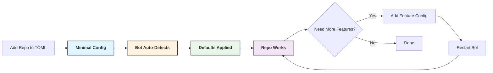

## Real Application Flow Examples

### Example 1: Push Event (GitLab Mirror)

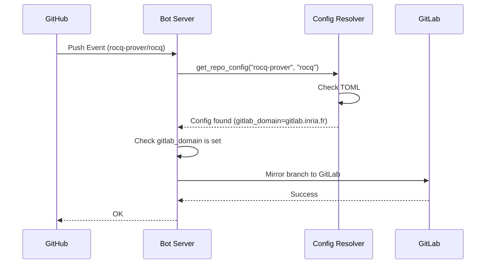

**Code Flow:**
1. Webhook received -> `handle_push_event_for_repos`
2. `get_repo_config_opt ~owner:"rocq-prover" ~repo:"rocq"` -> Returns config
3. Check `config.gitlab_domain` -> `Some "gitlab.inria.fr"`
4. Execute `mirror_action` with config values
5. No hardcoded checks - works for any repo with `gitlab_domain` set

### Example 2: Comment Event (Minimization)

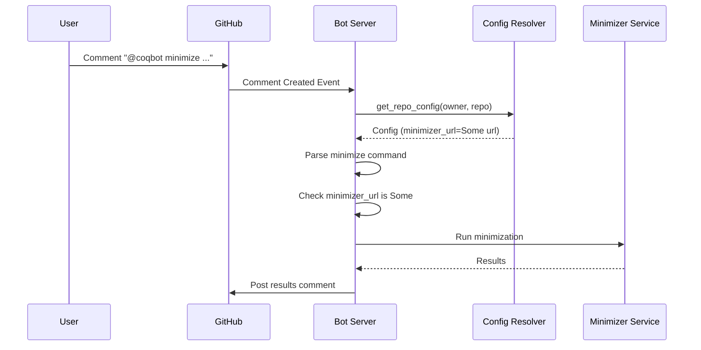

**Code Flow:**
1. Comment received -> `handle_comment_created`
2. `get_repo_config_opt` -> Returns config
3. Extract `config.minimizer_url`
4. If `Some url` -> Execute minimization
5. If `None` -> Return "feature not configured"
6. No hardcoded repository checks

### Example 3: Backport Feature

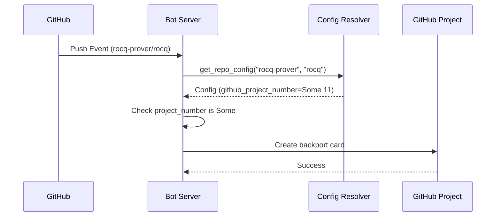

**Code Flow:**
1. Push event -> `handle_push_event_for_repos`
2. Config resolution -> `config.github_project_number = Some 11`
3. Backport action checks: `if Option.is_some config.github_project_number`
4. Creates project card using project number from config
5. Works for any repo with `github_project_number` set

## Configuration Priority Examples

### Example: minimizer_url Resolution

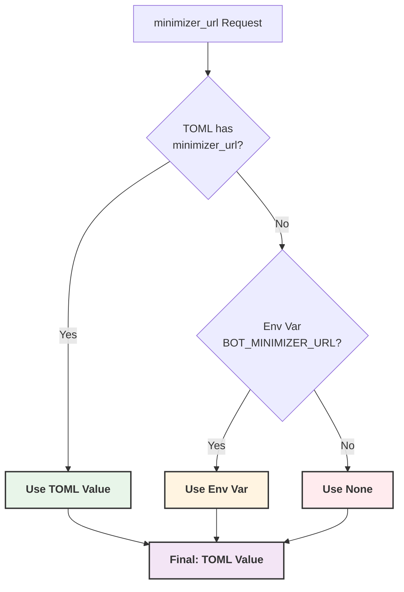

**Priority Order:**
1. **TOML** `[repositories.rocq] minimizer_url = "https://toml-url.com"`  (Wins)
2. **Env Var** `BOT_MINIMIZER_URL=https://env-url.com` (if TOML not set)
3. **None** (if neither set)

## Test Architecture and Flow

### Test Helper Flow

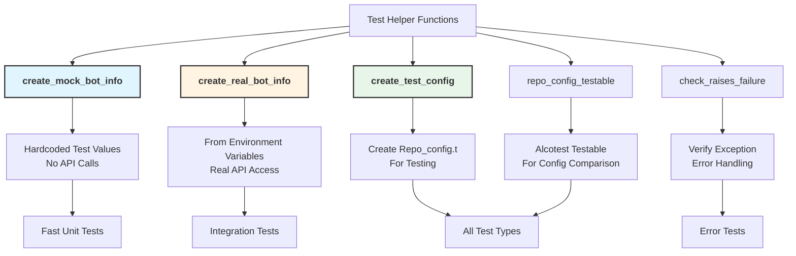

### Test Logic Flow: Configuration Resolution Test

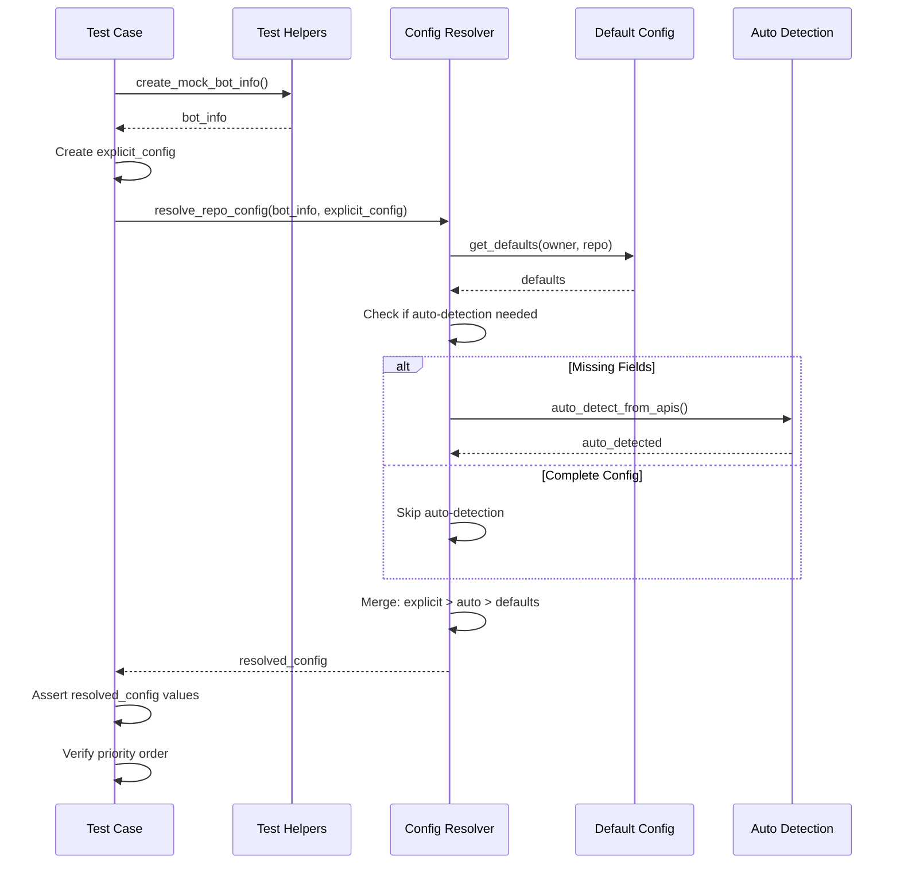
