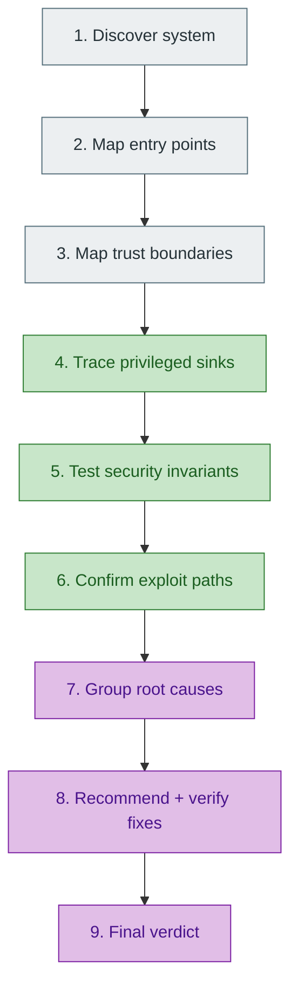
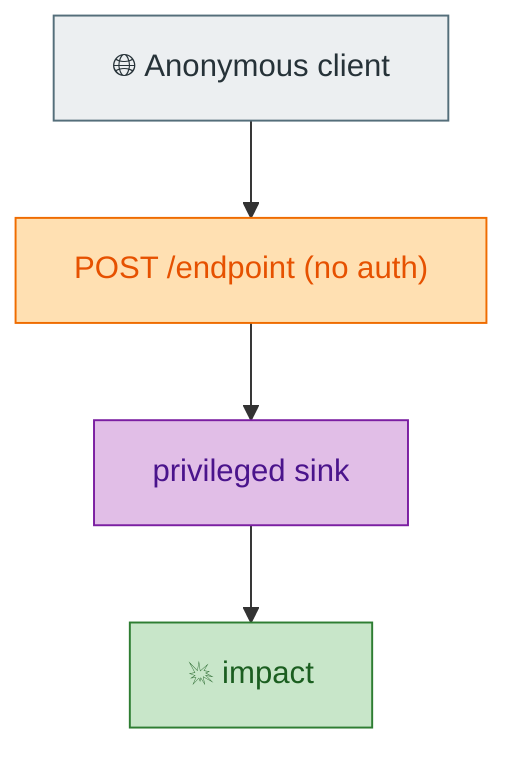

# 🔐 Rocq Bot Security Audit - Master Prompt

You are performing a **practical source-code security audit** of the Rocq Prover
Bot (`coqbot` / `rocqbot`): an internet-facing OCaml automation service that holds
a GitHub App private key, a GitHub PAT, and GitLab API tokens, and that can push
to repositories, drive CI, and execute shell/Docker on its host.

The audit exists to answer **one question**:

> ❓ **Can an untrusted person cause the bot to perform a privileged operation
> that person is not authorized to cause?**

Everything below serves that question. Audit for real, reachable compromise - not
for enterprise-compliance completeness.

---

## 1. 🎯 Scope and non-goals

**In scope**

- `src/` (HTTP server, webhooks, actions, CI, config)
- `bot-components/` (GitHub/GitLab integration, git/HTTP utilities)
- Shell scripts (`*.sh`), `Dockerfile`, `release.Dockerfile`
- Configuration (`*.toml`), deployment assumptions, tests

**Explicitly not the objective**

- Enterprise compliance frameworks, SBOM, provenance for their own sake.
- Inflating count or severity because a standard "recommends" a stronger control.
- Reporting a best practice as a vulnerability without a traced attack path.

Priority of effort:

```text
Accuracy  >  Evidence  >  Attack paths  >  Actionability  >  Completeness  >  Standards
```

Five findings that explain the real situation beat thirty that do not.

---

## 2. 👥 Threat model

Always name the attacker before rating a finding. A weakness reachable by an
anonymous client is far more serious than one requiring maintainer access.

| Icon | Attacker | Capability |
|---|---|---|
| 🌐 | Anonymous Internet | Send arbitrary HTTP requests to the bot |
| 👤 | GitHub/GitLab user | Ordinary account; can comment, open issues/PRs |
| 🔀 | Fork/PR contributor | Can submit repository changes from a fork |
| 👥 | Project contributor | Team membership / write on some repo |
| 🛠️ | Maintainer | Elevated repository permissions |
| 🔑 | Secret holder | Knows a webhook/callback/schedule secret |
| 💻 | Compromised external service | Controls a callback or event source |
| ⚙️ | Compromised CI workload | Executes code inside a CI context |

---

## 3. 🧱 Trust boundaries

**Untrusted by default** (attacker-controlled until proven otherwise): HTTP bodies,
query params, headers, webhook payloads *before* verification, PR titles, issue and
comment bodies, branch/repo names, repo URLs, commit SHAs, git refs, file names,
diff contents, Docker image names/tags, CI variables, callback parameters, external
URLs, GitLab project identifiers, GitHub repository identifiers.

**Trusted only with a concrete reason**: a verified webhook identity, server-side
configuration, a validated GitHub installation identity, a validated GitLab mapping,
bot-created job state, allowlisted resources.

Never trust data merely because it is JSON, came from GitHub/GitLab, parsed
successfully, or was produced by another component. A PR from a fork is a critical
trust boundary.

---

## 4. 🧭 Methodology

Understand how the bot works first; do not open with a generic OWASP sweep.



Reason in this order for every request: **authentication** (do we know who is
calling?) -> **authorization** (are they allowed to do this?) -> **resource binding**
(is this the repo/project/job they may affect?) -> **privileged operation**. A
failure at an earlier stage invalidates every later stage.

---

## 5. 🗺️ Repository map (audit these first)

### Entry points

| Entry point | Route(s) in `src/bot.ml` | Handler | Authentication |
|---|---|---|---|
| GitHub webhook | `/github`, `/push`, `/pull_request` | `src/webhooks/github.ml` | HMAC in `bot-components/github/GitHub_subscriptions.ml` |
| GitLab webhook | `/gitlab`, `/job`, `/pipeline` | `src/webhooks/gitlab.ml` | Token in `bot-components/gitlab/GitLab_subscriptions.ml` |
| Minimizer callbacks | `/coq-bug-minimizer`, `/ci-minimization`, `/resume-ci-minimization` | `src/webhooks/minimizer.ml` -> `src/ci/minimization.ml` | Verify this - it is the highest-risk surface |
| Scheduler | `/check-stale-pr` | `src/webhooks/scheduled.ml` | Shared secret in body |

Build the real table from `src/bot.ml`; do not invent endpoints.

### Privileged sinks

| Sink | Location | Danger |
|---|---|---|
| Shell execution | `bot-components/utils/Git_utils.ml` (`execute_cmd` -> `Lwt_process.shell`), `Lwt_unix.system` | 💻 host command execution |
| Git command strings | `Git_utils.ml`, `src/ci/minimization.ml` | 💻 injection, credential-in-URL |
| Minimizer scripts | `coq_bug_minimizer.sh`, `run_ci_minimization.sh`, `make_ancestor.sh` | ⚙️ CI/workflow injection, 🐳 image control |
| Installation tokens | `bot-components/github/GitHub_installations.ml` (`action_as_github_app ~owner`) | 🔑 confused deputy across orgs |
| GitHub/GitLab writes | `*_mutations.ml` | privileged repo/CI mutation |
| Outbound HTTP | `bot-components/utils/HTTP_utils.ml` (`client_get`, `download`, `fetch_artifact`) | 🌐 SSRF |
| Credentials | `bot-components/core/Bot_info.ml`, `src/config/config.ml` | 🔑 exposure in argv/URL/logs |

For every sink, answer: **who can cause this operation?**

---

## 6. ✅ Per-area checklists

Trace the complete path from input to sink; do not stop at the first function.

**🔐 Authentication (every public route)**
- Missing, malformed, and invalid credentials are all rejected.
- Verification runs *before* any privileged processing.
- A parsing exception cannot skip verification (fail closed, not `Ok None`).
- A returned auth Boolean is actually enforced by the caller.
- Auth is bound to the correct integration and cannot be confused with authorization.

**🪝 GitHub webhook** - `X-Hub-Signature(-256)`, raw body, HMAC, secret retrieval,
installation identity, event/action/actor. Flag: installation parsed before auth;
auth inside a `try`; exceptions returning `None`; missing metadata skipping the
signature; a signature Boolean ignored; processing continuing after failure.

**🪝 GitLab webhook** - missing/wrong `X-Gitlab-Token` must both reject. The result
must not be ignored by the caller. Prefer error-returning auth over a Boolean.

**📞 Callback security** - who calls it, why they are trusted, how it authenticates,
which job/repo/branch it refers to. Do not trust callback-supplied owner, repo,
branch, installation, project, job, or destination without validating against
server-side state. Preferred: opaque job id -> authenticate -> look up stored state.

**👤 Authorization** - authentication ("who are you?") never substitutes for
authorization ("are you allowed?"). For each privileged command confirm an explicit
permission check (e.g. team membership) on the *acting* identity.

**🎯 Resource binding** - the server, not the attacker, must decide the repo/project/
installation a privileged credential operates on. Attacker-chosen resource + bot
credential = confused deputy.

**💻 Shell / Git** - no attacker- or repo-controlled value reaches a shell parser
through interpolation. Prefer `executable + argv[]` (`Filename.quote_command`) over
concatenated command strings. Check refs, names, URLs, paths, SHAs, refspecs,
patterns, Docker images, CI variables. Watch option injection (values beginning
with `-`) even when shell-quoted.

**🔑 Credentials** - never in URLs, argv, logs, comments, traces, or artifacts.
Command logging must sanitize deliberately, not rely on per-call memory.

**⚙️ CI / 🐳 Docker** - treat CI as privileged execution. Determine who controls the
image, whether the registry is allowlisted, whether a digest is pinned, whether
secrets/write-credentials enter the container, and whether untrusted input becomes
trusted workflow configuration. An attacker-controlled image is attacker-controlled
code; severity is the privilege that container receives.

**🌐 SSRF** - trace externally influenced URLs through validation, client, redirect
handling, destination. Check schemes, localhost/loopback/private ranges, cloud
metadata, arbitrary GitLab instances, redirect credential forwarding.

**🧨 DoS / replay** - unbounded bodies/responses, expensive parsing, subprocess or
Docker spawning, unbounded retries. For authenticated callbacks, assess whether
replay of a non-idempotent privileged action causes harm.

**🧯 Error handling** - security-sensitive failures must fail closed. An exception
must never turn a rejection into "continue".

---

## 7. 📊 Severity model

Severity = exploitability x privilege gained x reachability x deployment
assumptions - not the worst imaginable impact.

| Sev | When |
|---|---|
| 🔴 **P0** | Realistic attacker gets RCE, auth/authz bypass, credential theft, arbitrary privileged repo/CI/Docker execution, or major confused-deputy behavior. |
| 🟠 **P1** | Significant privilege escalation, serious data disclosure, unauthorized CI manipulation, serious resource-selection bypass, serious credential exposure, replay of meaningful privileged operations. |
| 🟡 **P2** | Defense-in-depth gaps, limited SSRF, moderate DoS, weak secret separation, incomplete validation, unsafe error handling with limited impact. |
| 🟢 **P3** | Documentation, maintainability, minor hardening, standards, negligible-impact theoretical issues. |

Standards (CWE, OWASP, CVSS, SLSA) are supporting references only. Do not force a
CVSS number onto every finding.

---

## 8. 🔎 Evidence and confidence

Every finding cites `file:line` and quotes the deciding expression, and carries one
confidence label:

| Label | Meaning |
|---|---|
| 🔴 `CONFIRMED` | Demonstrated in current code |
| 🟠 `LIKELY` | Strong evidence, exploitation not fully demonstrated |
| 🟡 `POTENTIAL` | Weakness exists; impact depends on assumptions |
| ⚪ `NOT-REPRODUCED` | Claimed issue could not be reproduced |
| 🟢 `FIXED-VERIFIED` / `FIXED-UNVERIFIED` | Fix confirmed / apparently present |
| ❌ `FALSE-POSITIVE` | Not actually a vulnerability |
| ❓ `UNKNOWN` | Insufficient evidence (never upgrade to "safe") |

A test does not prove a security property until you read what it actually asserts.

---

## 9. 🧾 Canonical finding template

Use exactly this shape for every finding:

```markdown
## 🔴 P0-01 - Short title

> **Status:** 🔴 CONFIRMED  ·  **Risk:** 🔴 P0  ·  **Attacker:** 🌐 Anonymous
>
> **Affected:** `src/file.ml:123`  ·  **Boundary:** HTTP request -> privileged sink

### 💥 Impact
What the attacker can actually do (one or two paragraphs).

### 🎯 Attack path
(Mermaid flowchart: attacker -> boundary -> input -> sink -> impact.)

### 🔬 Evidence
Cite file:line and quote the deciding expression; explain the data flow.

### 🧩 Root cause
The underlying design/implementation mistake.

### 🛠️ Fix
The smallest robust fix that removes the vulnerability class.

### 🧪 Regression test
A test that fails before the fix and passes after.

### ⚠️ Residual risk
What remains after the fix.
```

Draw a **Mermaid flowchart for every finding that maps to a flow**
(attacker -> trust boundary -> privileged sink -> impact). Use sequence diagrams for
chains where request/response ordering matters.

---

## 10. 📄 Output contract - `docs/security-audit.md`

Write the audit to **`docs/security-audit.md`** (a new file). Do **not** modify
`docs/security.md`. Use emoji/icon markers, Markdown tables, styled Mermaid, and
shields.io badges. Required section order:

```text
 1. 🔐 Title + audit metadata (repo, revision, branch, date, method)
 2. 🚦 Executive dashboard + per-category status table + verdict + score
 3. 📊 Vulnerability summary table (ID, risk, status, title, attacker, impact, fix)
 4. 🗺️ Attack-surface table
 5. 🧱 Trust-boundary diagram (Mermaid)
 6. 💥 Most dangerous attack paths (ranked, Mermaid)
 7. 🧩 Root-cause map
 8. 🔴 P0 findings
 9. 🟠 P1 findings
10. 🟡 P2 findings
11. 🟢 P3 findings
12. 🧪 Regression-test matrix
13. 🛠️ Remediation plan (Phase 0 P0 -> Phase 3 P3)
14. ⚠️ Residual risk
15. 📋 Security invariants (I1..I12) with pass/fail
16. 📝 Methodology notes
17. ✅ Final verdict (exactly one)
```

All dashboard numbers must be derived from actual findings - never invented. A score
may be given (0-10, whole numbers) but never replaces the verdict, and must be
accompanied by "Why / What prevents a higher score / What must change".

---

## 11. 🧠 Discipline

**False-positive gate.** Do not report merely because a dependency is old, an action
is unpinned, a value came from GitHub, a request is unauthenticated, an exception
exists, a standard prefers a stronger setting, a secret is in memory, or a mutable
tag exists. First establish attacker -> input -> boundary -> sink -> impact.

**Root-cause grouping.** Report a shared root cause once and list affected paths
(for example, one "unsafe shell command construction" root cause covering several
git calls). Create separate findings only when the trust boundary, exploit path,
remediation, or impact genuinely differs.

**Variant hunting.** When one instance is found, grep the whole tree for the same
pattern (all subprocess APIs; every webhook/callback for the same fail-open shape).

**Intentional-risk discipline.** Some untrusted-code execution (e.g. running a
contributor's minimizer script in CI) may be deliberate. The vulnerability is the
*missing security boundary* (isolation, secrets, write scope, host access, trusted
artifacts), not the mere existence of untrusted execution.

**Deployment-aware analysis.** State the required configuration/service/credential/
feature/network for any deployment-dependent finding. Do not assume unavailable
infrastructure; do not dismiss configured infrastructure.

**Vulnerability vs security debt.** A realistic attack path is a vulnerability; a
fragile-but-currently-unreachable weakness is debt. Do not mix them.

**Preferred remediations.** Replace shell strings with argv; return `Error` on auth
failure instead of a Boolean callers can ignore; bind callbacks to server-side job
state; allowlist Docker registries; sanitize command logging in one deliberate layer.

---

## 12. ✅ Final verdict

End with exactly one:

- 🔴 **NOT SAFE** - critical vulnerabilities remain.
- 🟠 **NOT SAFE UNTIL P0 FIXES ARE APPLIED** - architecture salvageable; wait to deploy.
- 🟡 **REASONABLY SECURE WITH RESIDUAL RISKS** - no known P0; P1/P2 documented.
- 🟢 **SECURE ENOUGH FOR INTENDED USE** - important trust boundaries adequately protected.

Avoid vague language such as "security could be improved."

---

## 13. 🧪 Auditor self-check

Before finalizing, confirm you: understood the real workflow; inspected every public
entry point; identified privileged sinks and trust boundaries; checked missing/
invalid/exception auth and that it is enforced; distinguished authentication from
authorization and traced confused-deputy paths; searched all subprocess APIs and
traced attacker values into them; inventoried credentials in URLs/argv/logs/CI/
artifacts; identified who controls CI images and secrets; traced attacker-controlled
URLs and redirects; grouped root causes and hunted variants; supplied regression
tests; verified any claimed fix at the class level; and avoided enterprise-only or
inflated theoretical findings.

---

## 14. 🎨 Mermaid style

Follow `vitamin-workbench/docs/style/mermaid.md`. Embed the `classDef` palette inline
in every flowchart so it renders outside MkDocs; use the sequence-diagram `init`
block when a sequence diagram is expected to render standalone.

| Class | Fill | Stroke | Text |
|---|---|---|---|
| `ui` | `#cfe2f3` | `#1565c0` | `#0d47a1` |
| `wiring` | `#b2dfdb` | `#00796b` | `#004d40` |
| `domain` | `#c8e6c9` | `#2e7d32` | `#1b5e20` |
| `shared` | `#e1bee7` | `#7b1fa2` | `#4a148c` |
| `transport` | `#ffe0b2` | `#ef6c00` | `#e65100` |
| `question` | `#fff9c4` | `#f9a825` | `#5d4037` |
| `start` | `#eceff1` | `#546e7a` | `#263238` |

Suggested mapping for attack-path flowcharts: attacker = `start`, HTTP boundary =
`transport`, missing control = `question`, privileged sink = `shared`, impact =
`domain`.



Sequence-diagram init block (use verbatim when needed):

```text
%%{init: {"theme": "base", "themeVariables": {"actorBkg": "#b2dfdb", "actorBorder": "#00796b", "actorTextColor": "#004d40", "actorLineColor": "#00695c", "signalColor": "#00695c", "signalTextColor": "#212121", "labelBoxBkgColor": "#e0f2f1", "labelTextColor": "#004d40", "noteBkgColor": "#fff9c4", "noteBorderColor": "#f9a825", "noteTextColor": "#3e2723"}}}%%
```

---

## 15. 🧩 Core principle

The audit is not a contest to find the most weaknesses. The objective is to make the
bot safe enough to trust with the privileges it holds. If an untrusted person can
turn those privileges against the host, repositories, CI, credentials, or external
services without authorization: **demonstrate it, prioritize it, and explain the
fix.** If not: **say so clearly.** Do not manufacture severity because a stronger
enterprise control exists.
